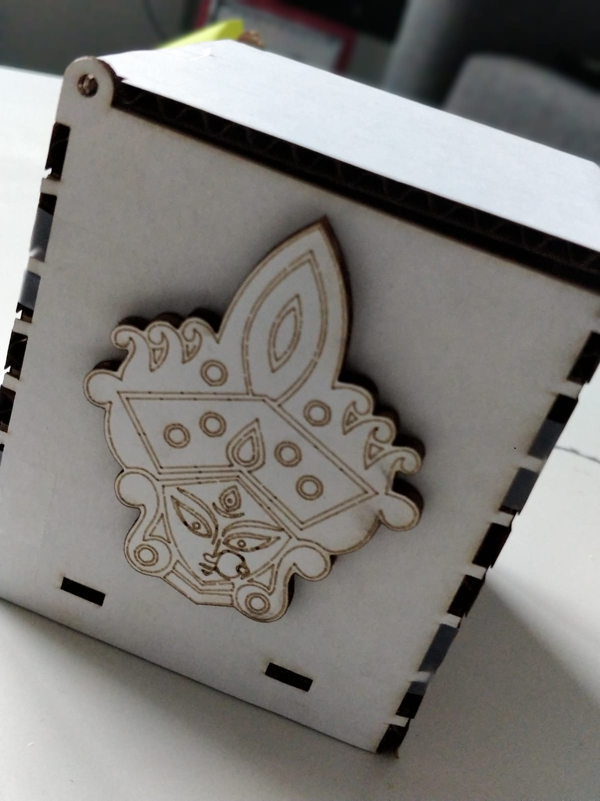
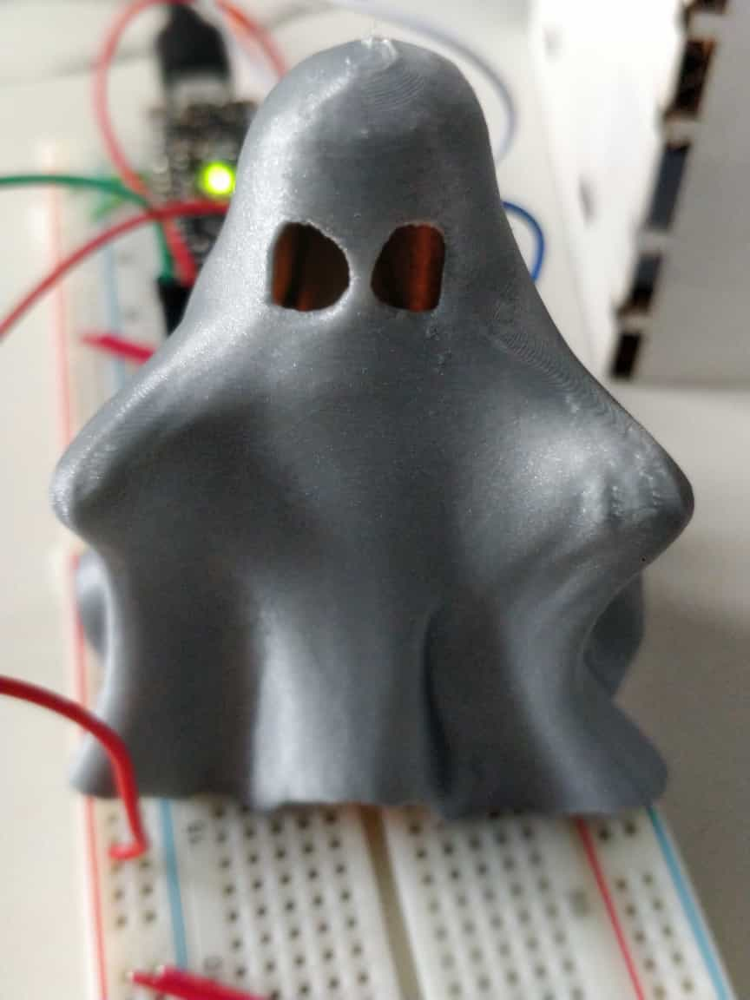
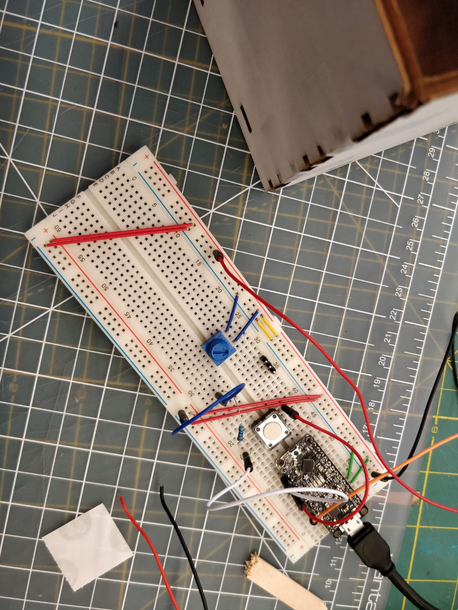
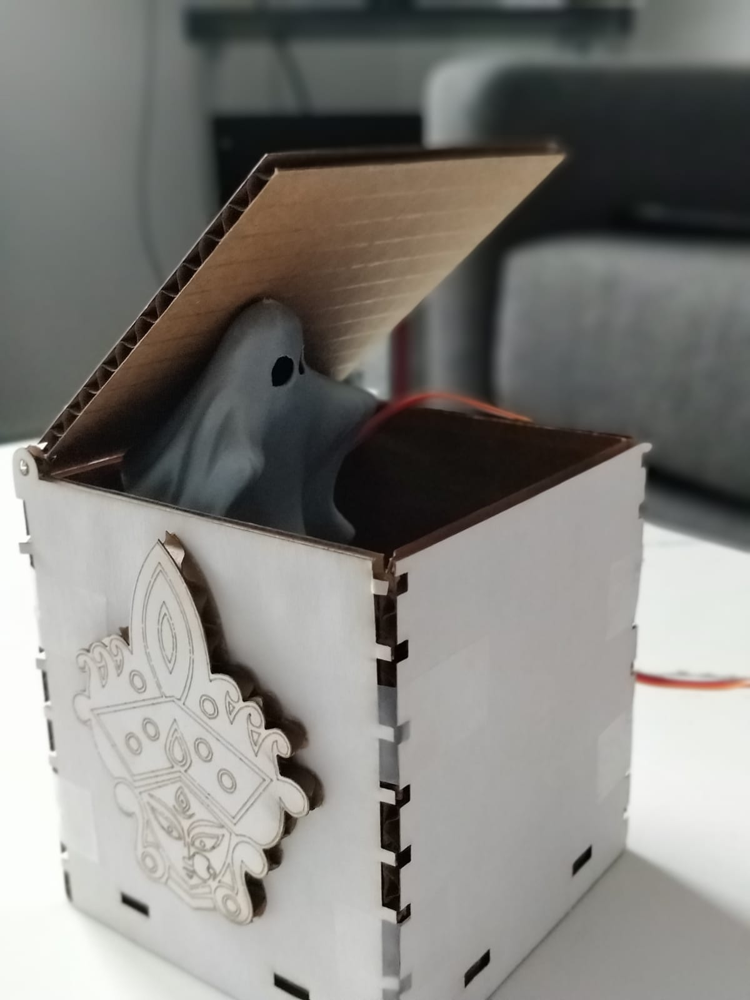
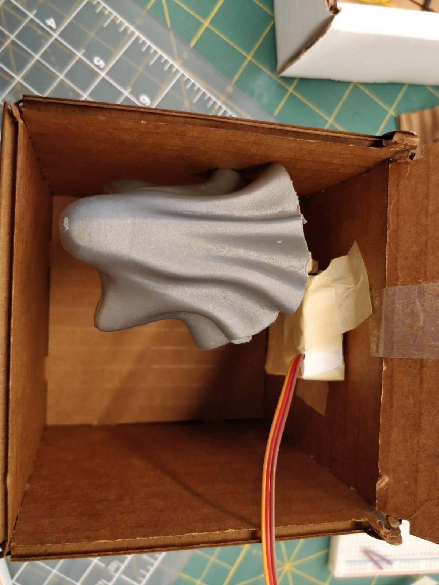

# Jack in the Box

## Design

I used laser cutting for box side design. And an open source stl file for a halloween ghost that I 3D printed for jack. 
My box is October themed. October for me is Halloween (my ghost jack) and Durga Puja (laser cut on the box). 

My jack in the box is triggered by a button on the circuit when the servo turns up and the box opens for the ghost to come out.

## Laser Cutting

**a. Include a photo of your box here.**
**b. Include `.stl` files.**
<br>
[Adobe Illustrator file for sides](./Durga.ai)
<br>



## 3D Printing

**a. Include a photo of your printed part here.**
**b. Include `.stl` or `.svg` files if you made modifications.**
<br>
[Stl file of the ghost](./gtl_ghost_redone.STL)
<br>
I added an LED inside the printed part for the Halloween feels. 



## Electronics

**a. Upload code & a photo of your electronic circuit here.**
<br>



## Putting it All Together



[Working of Jack in the Box Video](https://youtu.be/uCCudJwCtXg)


```
//  Box Lab 5
//
// If we see a voltage change on pin 2 the toggle switch on top of the useless box has
// changed position and we need to react!
//    A HIGH value on pin 2 means we should activate the servo to open the useless
//    box and attempt to return the switch to the "off" position.
//    A LOW value on pin 2 means the switch is off and we should return to our
//    inital (closed box) state.

#include <Servo.h>

#define servoPin  10
#define switchPin 2

#define closePos  10
#define openPos   110

Servo servo;
int switchState;
int previousSwitchState;

// call this when the input on pin 2 changes (LOW to HIGH *or* HIGH to LOW)
void ToggleSwitch(int switchState)
{
  if (switchState == HIGH)
  {
    servo.write(openPos);
    //Serial.println("switch state is HIGH.  servo.write(openPos) called to open useless box");
  }
  else
  {
    servo.write(closePos);
    //Serial.println("switch state is LOW.   servo.write(closePos) called to close useless box");
  }
  previousSwitchState = switchState;  // remember that the switch state has changed
}

void setup()
{
  //Serial.begin(9600);
  //Serial.println("Useless Box Lab 5");
  pinMode(5, OUTPUT);
  digitalWrite(5, HIGH);
  // start with the box closed and the switch in the off postion
  switchState = LOW;
  previousSwitchState = LOW;

  // connect to our servo and make sure it is in the closed position
  servo.attach(servoPin);
  servo.write(closePos);

  // we should probably pay attention to the switch
  pinMode(switchPin, INPUT);
}

void loop()
{
  int switchState = digitalRead(switchPin);
  if (switchState != previousSwitchState)
    ToggleSwitch(switchState);

  delay(20);
}
```

